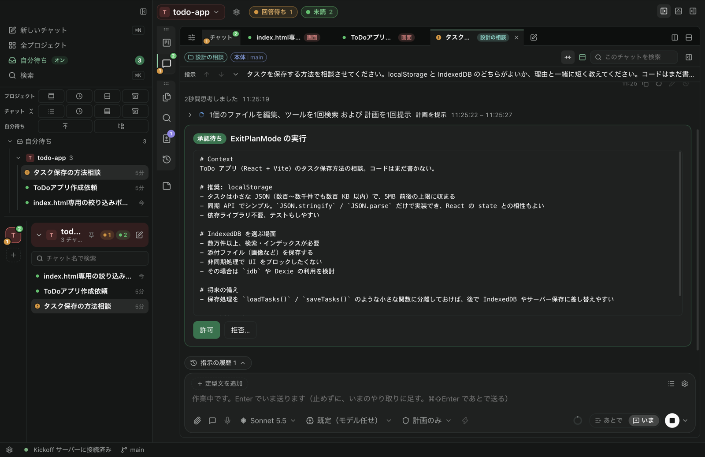

# Kickoff

> [!WARNING]
> 開発中です（v0.1）。macOS（Apple Silicon）でしか確かめていません。
> 機能・画面・保存の形は予告なく変わり、版によってはそれまでのデータを引き継がないことがあります。

アプリ開発を、AI エージェントとのチャットで進めるための Mac デスクトップアプリ。プロジェクトごとに、作業場所（git のワークツリー）・グループ・状態でチャットを並べ、並行して進める。

- 機能の一覧（受け入れの一覧と前提）: [docs/features.md](docs/features.md)
- 設計（構成・機能の一覧と向き・語彙）: [docs/architecture.md](docs/architecture.md)
- 書き方の決まり: `CLAUDE.md`（ルートと各フォルダ）

## 使い方

`npm install && npm run install-app` で `/Applications/Kickoff.app` に入れて起動する（前提は下の「前提」）。


1. **プロジェクトを作る**: サイドバーの「＋」から、新しいフォルダを作る（`git init` まで）か、既存のフォルダを取り込む。
2. **チャットで頼む**: 「新しいチャット」（⌘N）に指示を書いて送る。入力欄の下で、AI・モデル・考える深さ・権限モード（毎回確認・編集は自動で承認・Auto mode・計画）を選ぶ。作業ごとにワークツリー（ブランチ）を分ければ、複数のチャットを並行して進められる。
3. **自分の番を拾う**: チャットは状態ごとに並ぶ。「全プロジェクト」のボードや、サイドバーの「要対応」（回答待ち・エラー・未読）で、返事が要るものだけを順に開く。チャットはグループでまとめられる。
4. **答える・足す**: AI の承認依頼・質問には、チャットの中で答える（下の画面は、計画の承認待ち）。作業中でも、入力欄の「いま」で止めずに伝えるか、「あとで」で送信待ちに積める。



5. **確かめて出す**: 「変更」タブで差分を見てコミット・プッシュし、ワークツリーの帯から GitHub に PR を作る（マージは GitHub か GitHub タブで）。ターミナル・ブラウザ・ノート・DB クライアントもアプリの中で開ける。外出中は、スマホから承認・回答・次の指示ができる（同じ Wi-Fi か Tailscale。QR でペアリング）。

## 前提

- macOS（Apple Silicon）、Node.js 22.13 以上
- Claude Code にログイン済み（Kickoff は Agent SDK に同梱された Claude Code を使い、そのログインで動く。API キーは要らない）。ほかの AI（Codex・GitHub Copilot・Cursor・Gemini）は、それぞれのログインか API キーで選べる
- GitHub CLI にログイン済み（`brew install gh && gh auth login`）。開発するアプリのリポジトリは GitHub に自分で作り、remote（origin）を設定しておく（Kickoff はリポジトリを作らない）

## 開発

```sh
npm install
npm run dev                    # 開発版（Kickoff Dev）を起動
npm run dev:cdp                # 同じく、CDP のポート 9333 を開いて起動（画面の確かめ。scripts/ui-*.mjs が使う）
npm run fixture:seed           # 決まったデータを /private/tmp/kickoff-fixture に作る（scripts/devtools/fixture.mjs）
npm run dev:fixture            # そのデータで開発版を起動（コア 4319・CDP 9335。通しの確かめ node scripts/e2e/run.mjs が使う）
npm run typecheck              # 型（tsconfig をプロセスごとに。使っていない import・変数も見る）
npm run test:changed           # 変えたファイルに関係するテストだけ（作業中）
npm test                       # 全体を 1 プロセスで、ファイルの順番を毎回入れ替えて（Vitest）
npm run test:isolated          # 全体を、ファイルごとに新しいプロセスで（:changed にも :isolated を付けられる）
npm run test:db                # DB クライアントのドライバを Docker で立てた本物の DB で確かめる（Docker が要る）
npm run knip                   # 使っていない export・ファイル・依存
npm run build                  # ビルド（out/）
npm run mobile:typecheck       # スマホのアプリ（mobile/）の型
npm run daemon                 # Electron なしでコアだけを起動（データは KICKOFF_DATA_DIR）
npm run dist                   # .app / .dmg を作る
npm run install-app            # ビルドして /Applications/Kickoff.app（製品版）を入れ替える
npm run icon                   # build/icon.svg・icon-dev.svg からアイコンを作り直す
node scripts/ui-snapshot.mjs take <名前>   # 開発版の画面の DOM と計算後のスタイルを記録する（diff <前> <後> で比べる）
```

コミットと push のたびに git のフック（`.githooks/`。`npm install` が設定する）が確かめを流し、落ちたら止める。コミット時は文書の検査と、コードを含めば構造の検査・型・knip・テストの書き方の見張り・関係するテスト。push 時は文書と構造の検査・`npm test`・ビルド。コミットしない変更が混ざっていると止まる。

インストールしたアプリ（製品版）と開発版は、名前・保存先・ポートを分けてあり、同時に動かせる（`src/foundation/core/system/appEnv.ts`）。開発版のデータは、初めて起動したときに製品版のデータから一度だけ写す。

| | 製品版（`/Applications/Kickoff.app`） | 開発版 |
|---|---|---|
| 名前（Dock・メニューバー） | Kickoff | Kickoff Dev（アイコンに DEV の帯） |
| データ | `~/Library/Application Support/Kickoff/` | `~/Library/Application Support/Kickoff Dev/` |
| ポート | 4317 | 4318 |

製品版を入れ替えるときは、macOS のターミナルで流す（Kickoff の中のチャット・ターミナルからは流さない）:

1. 製品版で作業中のチャットがないことを確かめ、⌘Q で終える。
2. データを引き継がない版へ上げるときは、古いデータを消さずに退避する（知らない版の DB は開かずに止まる）: `mv "$HOME/Library/Application Support/Kickoff" "$HOME/Library/Application Support/Kickoff.old"`。開発版の `Kickoff Dev` も同じ。
3. `git pull && npm install && npm run install-app`
4. 引き継がない版なら、起動してプロジェクトを取り込み直し、設定・定型文・DB の接続を入れ直し、スマホはペアリングし直す。

`.claude/settings.json` の SessionStart フックは、Kickoff に入っている Claude Code に新しい版が出たら、このリポジトリのチャットのエージェントに知らせる（`scripts/check-agent-updates.mjs`）。

| 環境変数 | 説明 |
|---|---|
| `KICKOFF_PORT` | コアのポート（既定は製品版 4317・開発版 4318） |
| `KICKOFF_DATA_DIR` | `npm run daemon` のデータの置き場所（既定は開発版の `Kickoff Dev`） |
| `KICKOFF_HOST` | `npm run daemon` の待ち受けの住所 |
| `KICKOFF_REMOTE_DEBUG` | 開発版で CDP を開くポート |
| `KICKOFF_USER_DATA_DIR` | 開発版の保存先を変える（製品版では見ない） |
| `KICKOFF_ALLOW_API_KEY` | `1` のときだけ `ANTHROPIC_API_KEY` を Claude Code に渡す（既定はログインを使う） |
| `KICKOFF_EXPERIMENTAL_PROVIDERS` | 本物で確かめる前の AI を使う（`,` 区切りの ID。開発のとき） |
| `KICKOFF_RUN_TRACE` | `1` のとき、チャットの実行の出来事と命令をログに書く |

## 構成

| ディレクトリ | 役割 |
|---|---|
| `src/shared` | 純粋な型と関数（Node・DOM・Electron・React に依らない）。コア・画面・メイン・preload・スマホが読む |
| `src/foundation` | 機能の言葉を持たない土台（コア `core/`・画面 `ui/`・メインと preload `desktop/`） |
| `src/features` | 機能ごとのフォルダ（中は `core/`・`ui/`・`desktop/`・`worker/` と `CLAUDE.md`） |
| `src/app` | 組み立て（コア・メイン・画面の入口）。ここだけが全部の機能を知る |
| `mobile` | スマホのアプリ（Android・Expo。別の npm のまとまり） |
| `native`・`build`・`scripts` | 音声認識の補助コマンド（Swift。`swiftc` がなければ作らずにビルドを続ける）・アイコン・道具 |

詳しくは [docs/architecture.md](docs/architecture.md)。

## ライセンス

[PolyForm Noncommercial License 1.0.0](LICENSE)。オープンソースのライセンスではありません。

- 非商用の目的なら、使う・直す・配ることができます（個人の学習・研究・実験・趣味、慈善団体・教育機関・公的な研究機関・行政機関での利用など）。配るときは、ライセンスの条文（または URL）と `LICENSE` の先頭の `Required Notice:` の行を一緒に渡してください。
- 商用の目的には使えません。改変したものを含めて売ること、有料のサービスにすること、会社の業務で使うことなどが当たります。商用で使いたいときは、作者に相談してください。
